# Incubator For Apnea Patients

## Project Overview
Design of neonatal incubator with heating and humidity control units and neonatal apnea detection.

## General Structure
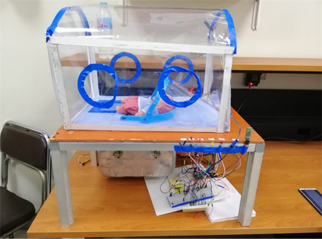

### Our project consists of:
A- Sensors and feedback
B- Alarm system
C- heat and humidity units
D- Extra features; apnea detection and mobile application  

## A- Sensors 
### 1- DHT Sensor 
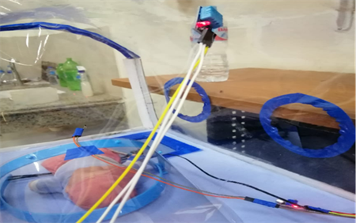

DHT sensor is placed in the ceiling of the incubator to measure the humidity percentage and the air temperature inside it.
 
### 2- Thermistors
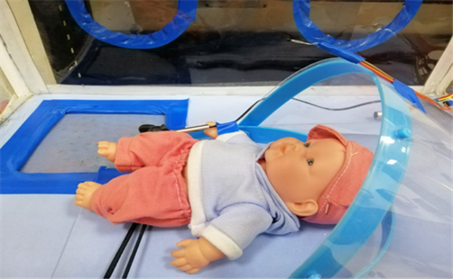

One thermistor is used to measure baby’s skin temperature. Another thermistor is put near the baby’s respiration flow to measure the difference in temperature and by that it detects whether the baby has stopped breathing at any moment. This is used for sleep apnea patients.
 
### 3- Sound sensor
•	The sound signal is detected through sound sensor that has analog output. 

•	 The signal enters MCU of model (Arduino UNO), when the detected sound is above the safe range (65 dB) for baby hearing the system enters the alarm mode. 

•	The American Academy of Pediatrics recommends that sound levels be lower than 45 dBA in the NICU.

•	In the Alarm mode the LED will turn on indicating the noise.

## Noise control System Block diagram:
 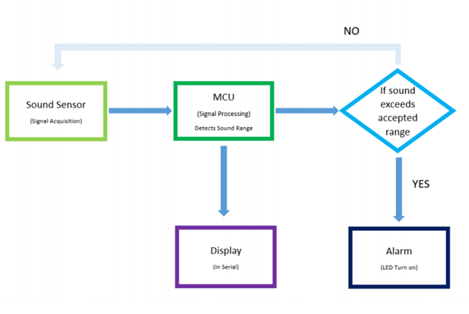

### 4-Air Flow and Oxygen concentration
Feedback from the flow sensor controls the fan to adjust the proper flow of oxygen from 0.5 to 2 L/min. 

### 5- Ultrasonic sensor 

<figure>
  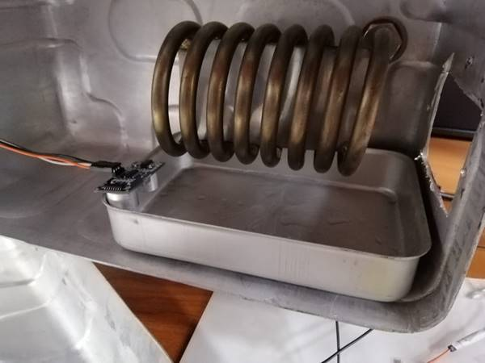
  <figcaption>heater and water tank with ultrasound sensor for detecting water level </figcaption>
</figure>

Ultrasonic Sensor is used to sense the water level in water tank and produce alarm if water level is low.
NOTE: Ultrasonic sensor can’t operate in the temperature of the heating unit.
 

There is an opening for air entrance must covered by suitable filter and the box is normally closed to preserve heat and keep the internal air filtered.

## B- Alarm System
An Alarm system is designed using the data received by the sensors to produce an alarm signal if a value is not in the accepted range 

The alarm system consists of alarm LEDs to be illuminated when something goes wrong with its corresponding parameter measurement and the mobile application to get a warning message stating the problem. 
The parameters measured are:
•	Skin temperature
•	Water tank level
•	Air temperature
•	Humidity
•	Noise level (Sound)
•	The respiration rate (for apnea detection)
 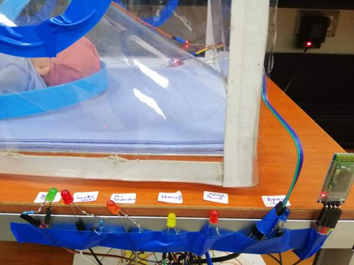

## C- Heat and humidity units
The feedback from the temperature sensor and humidity sensor is used to control the heater and fan, the fan and heater is connected to 220 VAC via relays and receive their control signal from arduino .

Air controlled:
Heating (Accepted range  32:36)
•	If Air temperature is in [32 °C : 34}  : Heater ON 
•	 otherwise the Heater is off (Temperature should be steady at (34°C +2))
Humidity (Accepted range 70%:80%)
### 1- heater is on:
•	If humidity is less than 70 % : fan ON
•	If humidity greater than 70% : Fan OFF
### 2- heater is off
<figure>
  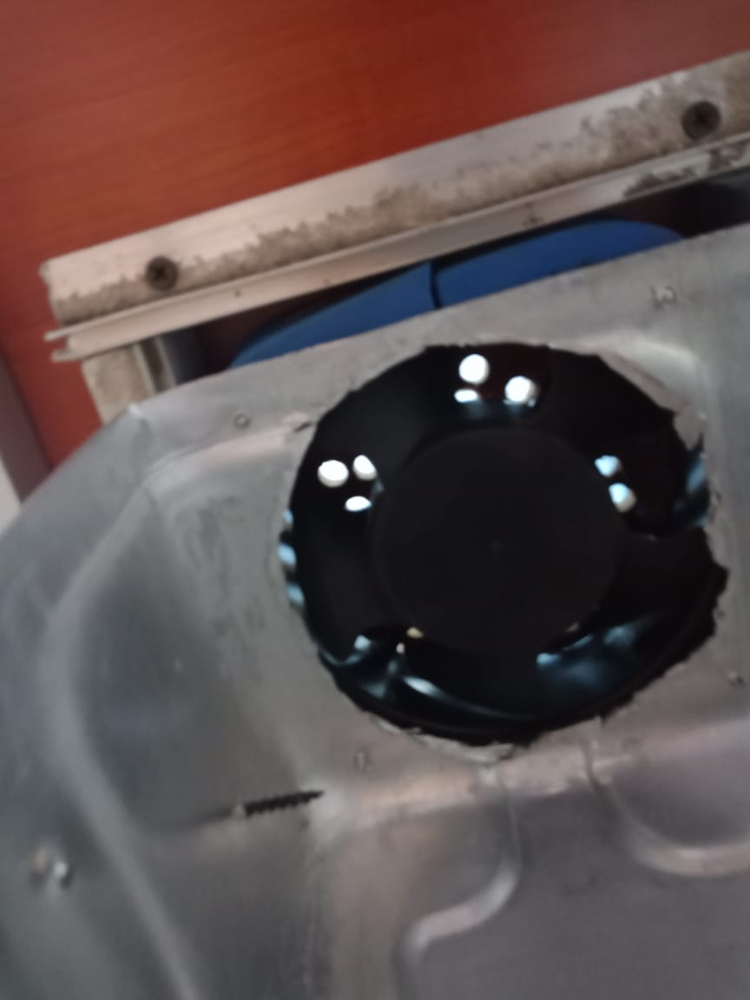
  <figcaption>Fan placed at the top of the heater box </figcaption>
</figure>

•	If humidity is less than 70% Fan OFF
•	If humidity is greater than 80% : Fan ON 
 
 

 
## D- I) Neonatal apnea detection
Neonatal apnea detection system is designed using thermal airflow sensor (Thermistor) which uses the difference between the temperature of exhaled and ambient air to detect apnea.

  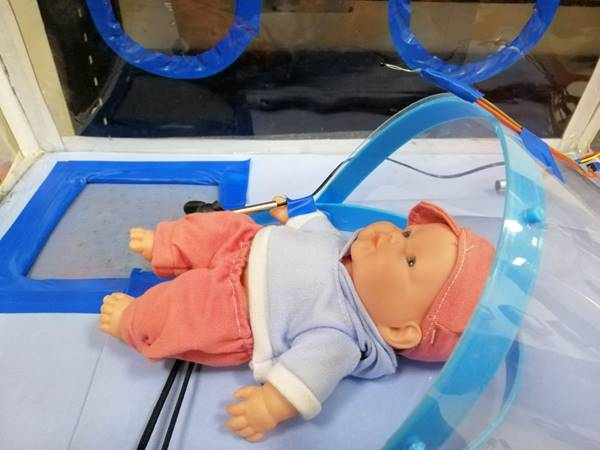

 
## D- II) Mobile application
All sensor readings are displayed in a mobile application with warning messages if anything went wrong such as a probe fail or the humidity percentage is too low or the baby has stopped breathing, etc...
First, we search for the available nearby incubators, then we select the required one to be connected with the application and finally, we receive the sensors readings and alarms. 
The following figures illustrate the interface of the mobile application.
 
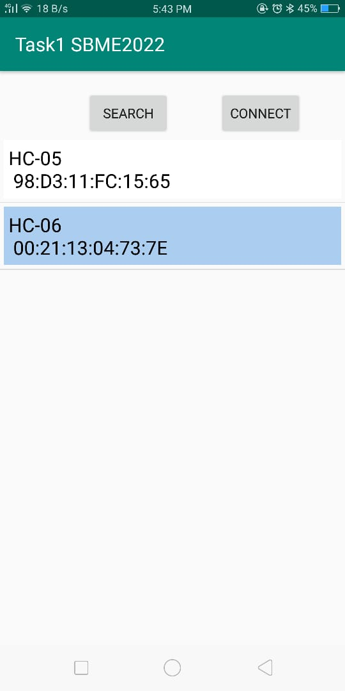
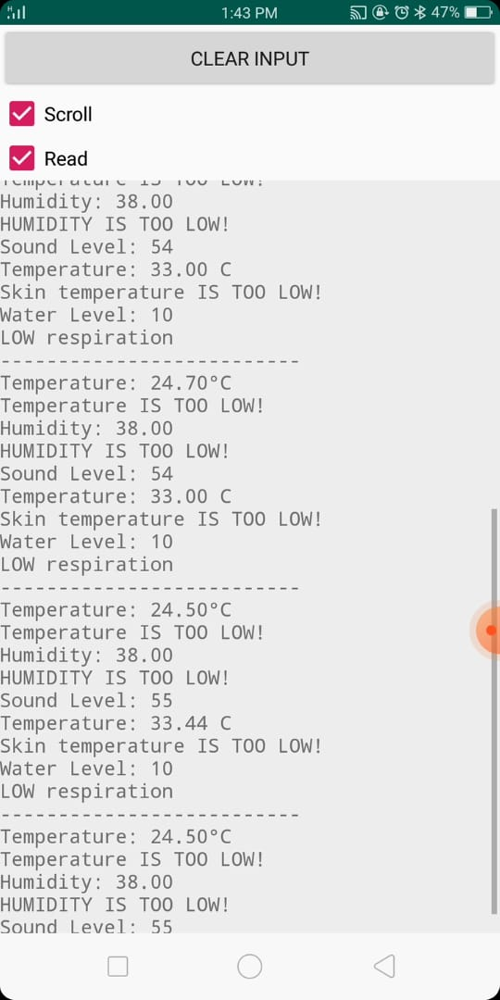

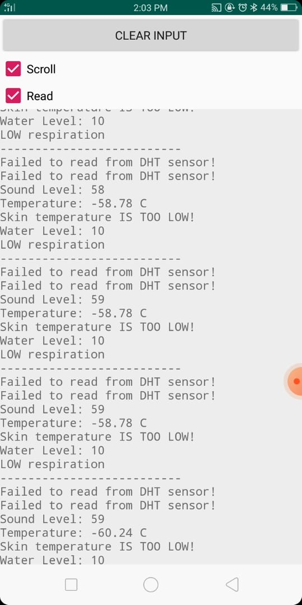
Example of probe failure of Humidity&Air temperature sensor when we disconnected it:

Circuit Connection

 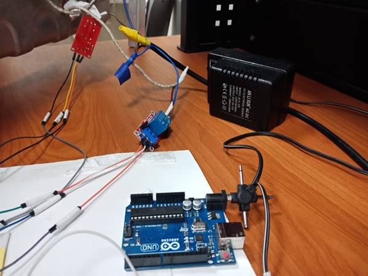
The figure shows the usage of relay for both fan and heater connections as they require AC 220v .
Each relay has 5 used pins : 2 pins connected to AC 220 , GND to switch between them for control and 5v , GND for relay power and the last pin connected to arduino to control the switch. 
 
 

## contribution:

Amira Yehia	

Aya Ehab	

Salma Haytham	

Mayar Tarek	

Noran El-Shahat	

Nouran Khaled	
